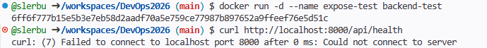
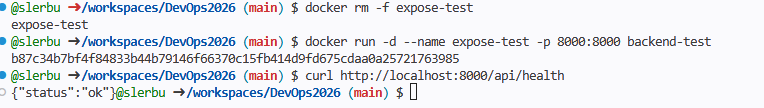
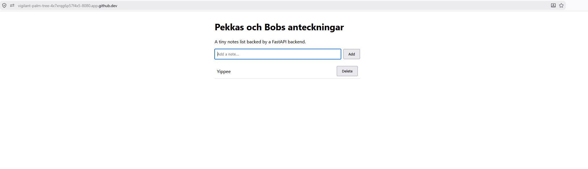
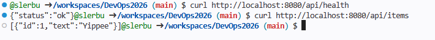
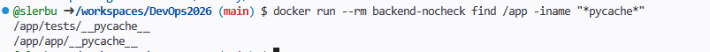
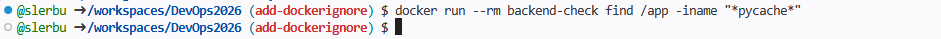

Steg 1:
Gissningar
1) Första raden: "FROM python:3.12-slim"
2) Om pip install kommer efter så körs pip install pånytt alltid då man gör ändringar i /app
3) Ja? Lol du gjorde någo med portar på föreläsningen vet int vade just dehär ja va int riktit fokuserad. Update efter test:

Nu fungerar de!

Steg 2: Gissningar/funderingar
Det finns inget RUN eller CMD eftersom nginxinc/nginx-unprivileged:alpine gör redan båda

