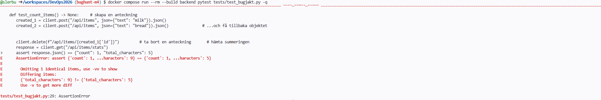
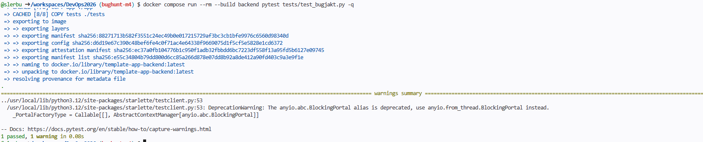

1. 

Bugg!!!!!

 
Bugg med test!!!!!

2. Hade inte skrivit rätta/tillräckligt omfattande tester. Då oberoende hur många folk kör testerna ser de ok ut, om de inte manuellt börjar granska koden.

3. Fixad :)

I def_delete_item() hämtade jag _total_characters som vi adderar till då vi lägger till nya items. Gjorde så att när vi raderar en item så subtraherar vi dens längd från _total_characters :3

4. Det skulle ha behövs ordentliga tester, eller manuell granskning av koden
